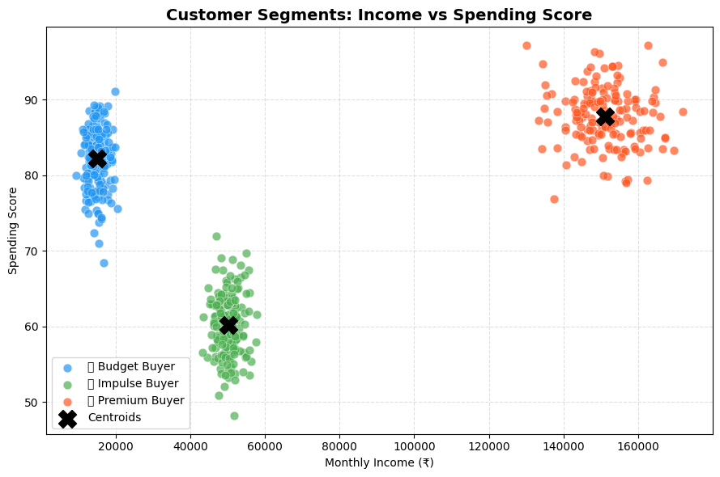
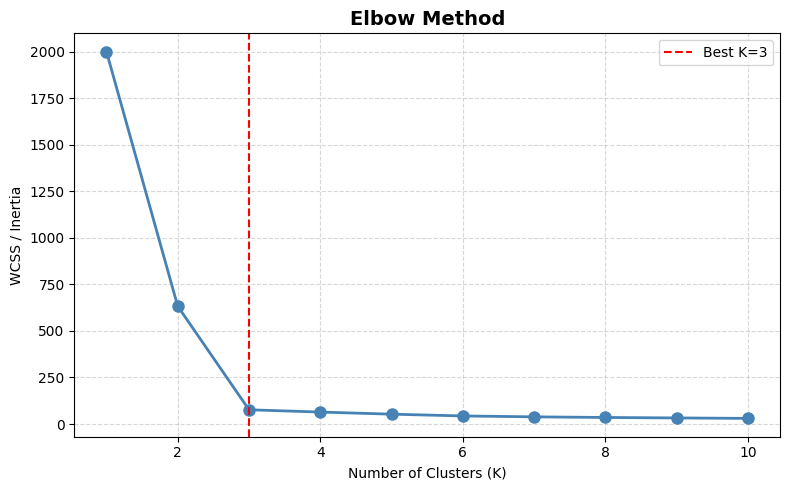

# 🛍️ Customer Segmentation with K-Means Clustering

An unsupervised machine learning project that segments customers into meaningful groups — **Budget Buyers**, **Impulse Buyers**, and **Premium Buyers** — based on income, spending behavior, and purchase patterns. Built for data-driven marketing and personalization strategies.



## 📌 Overview

Businesses don't have one customer — they have many types of customers. This project uses **K-Means clustering** to automatically discover those hidden customer groups from raw transactional/behavioral data, then profiles each segment so it can drive real marketing decisions (targeted offers, loyalty programs, premium upsells, etc).

## 🔍 Workflow

1. **Data Cleaning** — load data, check structure and missing values
2. **Feature Selection** — `Monthly_Income`, `Spending_Score`, `Avg_Order_Value`, `Discounts_Used`
3. **Scaling** — standardize features with `StandardScaler`
4. **Optimal K Selection** — Elbow Method + Silhouette Score
5. **Clustering** — K-Means with the optimal number of clusters
6. **Segment Labeling** — clusters mapped to human-readable personas by income level
7. **Visualization & Reporting** — segment scatter plot + per-segment summary stats exported to CSV

## 📊 Choosing the Right Number of Clusters

**Elbow Method**



Silhouette scores across K=2 to 10 are also computed to confirm the best K programmatically, rather than relying on the elbow chart alone.

## 🧬 Customer Segments Discovered

| Segment | Description |
|---|---|
| 💰 **Budget Buyer** | Lower income, cautious spending |
| 🛍️ **Impulse Buyer** | Mid-range income, spends freely |
| 👑 **Premium Buyer** | Higher income, high-value orders |

Each segment's average income, spending score, order value, and discount usage is printed and saved to `customer_segmentation_v2_results.csv`.

## 🛠️ Tech Stack

- Python 3
- pandas, NumPy
- scikit-learn (KMeans, StandardScaler, silhouette_score)
- Matplotlib, Seaborn

## 🚀 Getting Started

### 1. Clone the repository
```bash
git clone https://github.com/<your-username>/customer-segmentation-kmeans.git
cd customer-segmentation-kmeans
```

### 2. Install dependencies
```bash
pip install -r requirements.txt
```

### 3. Add your dataset
Place your `customer_segmentation_v2.csv` file in the `data/` folder. The notebook already reads from `data/customer_segmentation_v2.csv`, so no path changes needed.

### 4. Run the notebook
```bash
jupyter notebook customer_segmentation.ipynb
```

## 📁 Project Structure

```
customer-segmentation-kmeans/
├── customer_segmentation.ipynb   # Main analysis notebook
├── data/                          # Place your input CSV here
├── assets/                        # Chart images used in this README
├── requirements.txt
└── README.md
```

## 💡 Future Improvements

- Add more behavioral features (purchase frequency, recency, category preference)
- Try alternative clustering methods (DBSCAN, Hierarchical) for comparison
- Build a small dashboard (Streamlit) to explore segments interactively
- Validate segments against real business KPIs (churn, LTV)

## 📄 License

This project is licensed under the MIT License.
